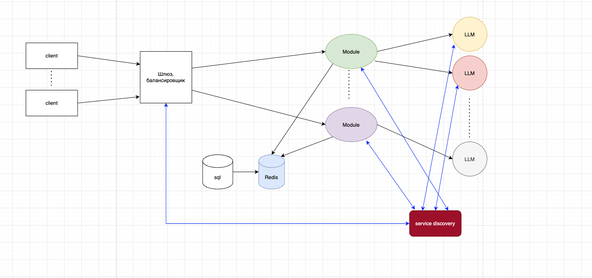
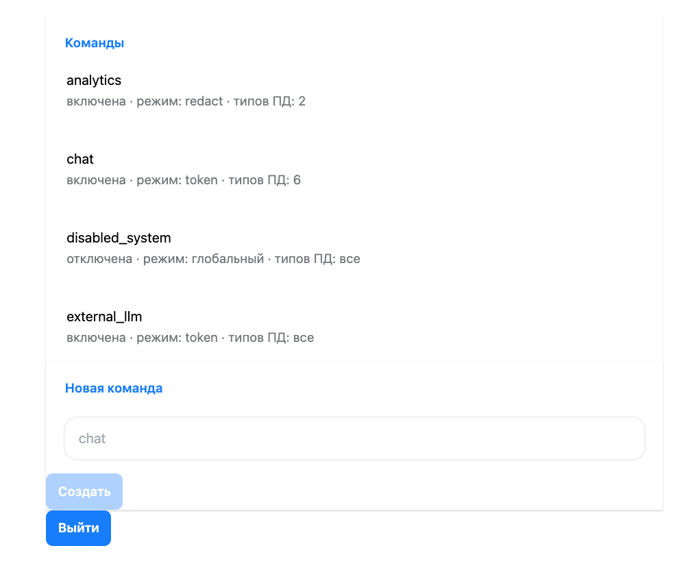
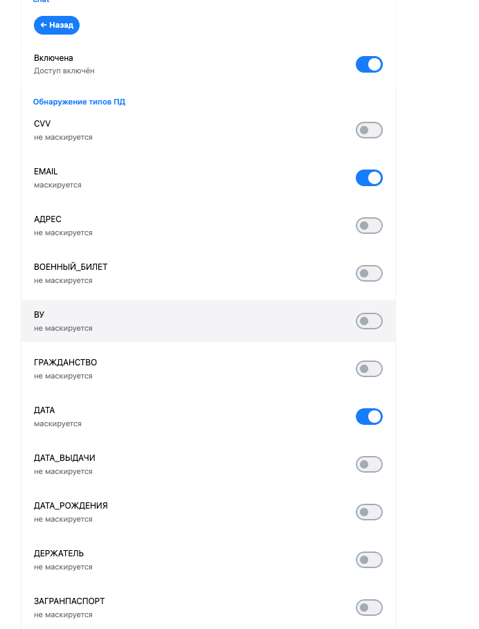
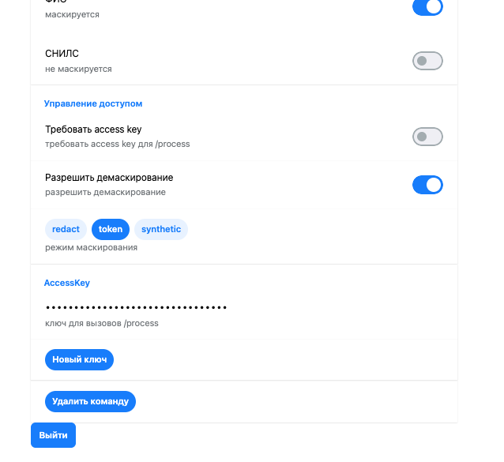
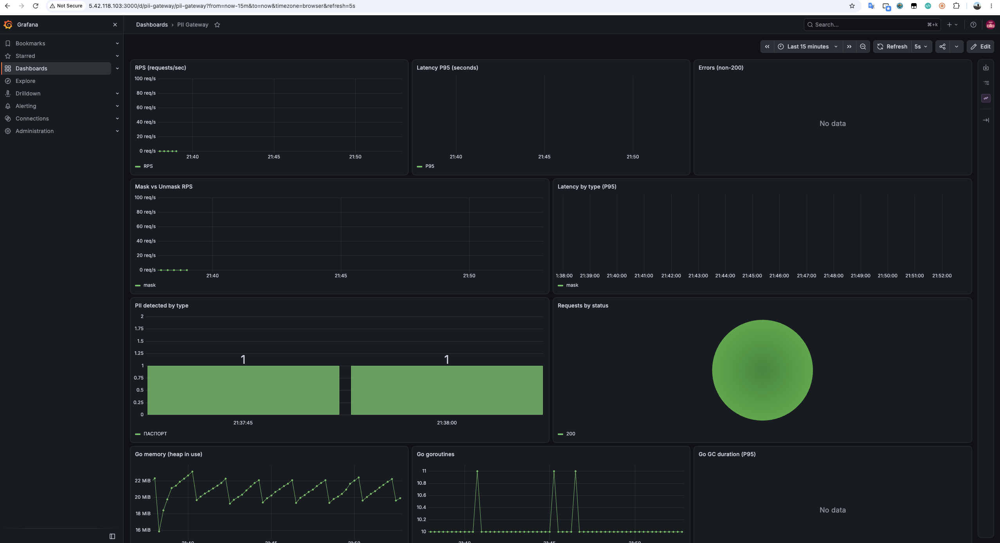

# PII Gateway v2 (version2)

Гибридный шлюз маскирования персональных данных (ПД): быстрые детерминированные правила +
контекстная оценка уверенности + опциональная NER-модель + span resolver + обратимый
токенизированный режим. Заменяет v1 : итог — **та же точность маскирования, но без LLM в
пайплайне** и с исправлением scorer-критики («12.03.1998 рядом с ФИО»).

Проектировался под high-load: RPS 1000+ при latency < 100 ms, round-trip `POST /process`
без потерь (демаскирование возвращает исходную строку байт-в-байт).

## Ссылки на сервисы

| Сервис | URL |
|--------|-----|
| **Web / Админка (SPA)** | `http://5.42.118.103:5173/` |
| **API (PII Gateway)** | `http://5.42.118.103:5173/process` |
| Swagger UI | `http://5.42.118.103:5173/docs` |
| OpenAPI-спецификация | `http://5.42.118.103:5173/openapi.yaml` |
| Health-check | `http://5.42.118.103:5173/health` |
| Prometheus-метрики | `http://5.42.118.103:5173/metrics` |
| Prometheus UI | `http://5.42.118.103:9090` |
| Grafana | `http://5.42.118.103:3000` (admin/admin) |
| Grafana-дашборд «PII Gateway» | `http://5.42.118.103:3000/d/pii-gateway/pii-gateway` |

## Архитектура



```
Система-потребитель / Жюри / LLM
     │  POST /process {payload, payload_id}   (один внешний порт :5173)
     ▼
┌──────────────────────────────────────────────────────────────┐
│                    web nginx (единая точка входа)            │
│  /v1/*  /process  /health  /metrics  /docs  /openapi.yaml    │
│  └───────────────► pii-module-v2 (внутренний :8080)          │
│  /  (всё остальное) → SPA (admin UI)                         │
└──────────────────────────────────────────────────────────────┘
     │
     ▼
┌──────────────────────────────────────────────────────────────┐
│                      pii-module-v2                           │
│  Идентификация → Маскирование → (LLM) → Демаскирование       │
│  Detector → эскалация дат → Resolver → Whitelist → Context   │
│  → Confidence → Mask/Tokenize/Synthetic → Store              │
└──────────────────────────────────────────────────────────────┘
```

**Принцип работы (1–2 минуты):** шлюз принимает текст с ПД, детектирует
персональные данные детерминированными правилами + контекстом, маскирует их
(redact/token/synthetic), при необходимости передаёт замаскированный текст в
LLM, а затем демаскирует ответ по сохранённой карте `token → значение`.
Критичные типы ПД определяются независимыми проверяемыми правилами, а не LLM,
что даёт предсказуемость и высокий RPS.

## Все URL (единый внешний порт :5173)

| URL | Назначение |
|-----|------------|
| `http://5.42.118.103:5173/` | Админка (SPA) — список команд, детальные настройки |
| `http://5.42.118.103:5173/process` | POST — маскирование/демаскирование |
| `http://5.42.118.103:5173/v1/systems` | Управление системами (Bearer-токен) |
| `http://5.42.118.103:5173/v1/config` | Read-only конфигурация |
| `http://5.42.118.103:5173/v1/auth/login` | Вход в админку |
| `http://5.42.118.103:5173/health` | Health-check → `ok` |
| `http://5.42.118.103:5173/metrics` | Prometheus-метрики |
| `http://5.42.118.103:5173/docs` | Swagger UI (Try it out) |
| `http://5.42.118.103:5173/openapi.yaml` | OpenAPI-спецификация |
| `http://5.42.118.103:9090` | Prometheus (отдельный порт) |
| `http://5.42.118.103:3000` | Grafana (admin/admin) |
| `http://5.42.118.103:3000/d/pii-gateway/pii-gateway` | Дашборд «PII Gateway» (RPS, latency, PII, Go runtime) |

## Демо для жюри

**1. Отправить тестовый текст (маскирование):**
```bash
curl -X POST http://5.42.118.103:5173/process -H 'Content-Type: application/json' \
  -d '{"payload":"Клиент Иванов Иван Иванович, паспорт 4509 123456, тел +7 912 345-67-89, карта 4276 1234 5678 9012","payload_id":"demo-1"}'
# → {"result":"Клиент [ФИО], паспорт [ПАСПОРТ], тел [ТЕЛЕФОН], карта [КАРТА]"}
```

**2. Получить демаскированный результат (тот же payload_id + маска):**
```bash
curl -X POST http://5.42.118.103:5173/process -H 'Content-Type: application/json' \
  -d '{"payload":"Клиент [ФИО], паспорт [ПАСПОРТ], тел [ТЕЛЕФОН], карта [КАРТА]","payload_id":"demo-1"}'
# → {"result":"Клиент Иванов Иван Иванович, паспорт 4509 123456, тел +7 912 345-67-89, карта 4276 1234 5678 9012"}
```

**3. Логи:** `docker compose logs -f pii-module-v2` — структурированные (slog),
без значений ПД (`payload_id`, `types`, `latency_ms`).

**4. Метрики:** `http://5.42.118.103:5173/metrics` (Prometheus-формат) и Grafana
`http://5.42.118.103:3000` (admin/admin) — дашборд «PII Gateway»
(`/d/pii-gateway/pii-gateway`): RPS, latency P95, ошибки, mask/unmask,
PII по типам, Go runtime.

**5. Готовый сценарий:** `./scripts/curl_demo.sh http://5.42.118.103:5173`

**Пайплайн (этапы, `internal/pipeline/pipeline.go`):**

1. **Detect** — `internal/detector`: regex-правила + capture-правила с ключевыми словами,
   опционально NER (только для «сомнительных» участков). Для каждого span — `Confidence`.
2. **Эскалация дат** — обычная `ДАТА` (низкая уверенность, 0.7) повышается до
   `ДАТА_РОЖДЕНИЯ` с confidence 1.0, если находится в пределах ~80 байт от «якоря» ПД
   (ФИО, место рождения, адрес, паспорт). Это и есть исправление scorer-критики:
   `указал: Иванов Иван Иванович, 12.03.1998` → `[ДАТА]`, при этом
   `Банк открылся 12 марта 1998 года` не маскируется.
3. **Resolve** — `internal/resolve`: снятие пересечений по приоритету типа
   (КАРТА > ПАСПОРТ > … > ИНН), длине и позиции.
4. **Whitelist** — `internal/whitelist`: известные не-ПД сущности (Пушкин, Толстой,
   «отделение Альфа-Банка») блокируют маскирование независимо от детектора.
5. **Context** — `internal/context`: ключевые слова-усилители (`клиент`, `заёмщик`,
   `адрес регистрации`, …) поднимают confidence, слова-штрафы (`банк`, `филиал`,
   `поэт`, …) опускают. ±100 байт вокруг span.
6. **Gate** — порог 0.95: ниже — не маскируем. Одиночный «чувствительный» тип
   (ПИН/CVV из `sensitive`) маскируется только при наличии другой ПД рядом.
7. **Mask / Tokenize** — `internal/masker`: redact-режим → v1-плейсхолдеры `[КЛАСС]`,
   token-режим → `[LABEL_NNN]` с обратимой картой `token → значение`.

## Как распознаются персональные данные

Детекция — **гибридная**: три независимых механизма, объединённых в один
`Detector` (`internal/detector`). Ниже — как именно распознаётся каждый тип ПД.

### 1. Регулярные выражения (fast path, `internal/detector/rules.go`)

Структурированные типы распознаются скомпилированными regex-правилами
(`Rule{Re, ContextRe, CaptureRe, Keyword, Priority, Confidence}`). Правила
независимы, поэтому для текстов ≥ 4096 байт детекция **параллелится** по ядрам
(`detectParallel`), для коротких — последовательно (без оверхеда горутин).

| Тип | Паттерн | Примечание |
|-----|---------|------------|
| `ПАСПОРТ` | `\d{2}\s?\d{2}\s\d{6}` | требует контекст `паспорт/серия` |
| `ЗАГРАНПАСПОРТ` | `\d{2}\s?\d{7}` | контекст `загранпаспорт` |
| `ВУ` | `\d{2}\s?\d{2}\s\d{6}` | контекст `водительское удостоверение` |
| `ВОЕННЫЙ_БИЛЕТ` | `\d{2}\s?\d{2}\s\d{6}` | контекст `военный билет` |
| `СВИДЕТЕЛЬСТВО_О_РОЖДЕНИИ` | `\d{2}\s?\d{2}\s\d{6}` | контекст `свидетельство о рождении` |
| `ИНН` | `\d{10,12}` | |
| `КАРТА` | `\d{4}\s?\d{4}\s?\d{4}\s?\d{4}` | |
| `CVV` | `cvv[:\s]*\d{3}` | |
| `ПИН` | `(пин\|pin)[:\s]*\d{4}` | |
| `EMAIL` | `[a-z0-9._%+-]+@[a-z0-9.-]+\.[a-z]{2,}` | |
| `ТЕЛЕФОН` | `(\+7\|8)[\s\-]?\(?\d{3}\)?...` | |
| `КОД_ПОДРАЗДЕЛЕНИЯ` | `\d{3}[-–]\d{3}` | |
| `ДАТА_РОЖДЕНИЯ` | `\d{2}[./-]\d{2}[./-]\d{4}` и др. | требует контекст `родился/дата рождения` |
| `ДАТА` | те же паттерны, confidence 0.7 | эскалируется в `ДАТА_РОЖДЕНИЯ` рядом с ПД |

**Три вида правил:**
- **`Re`** — прямое совпадение. Если задан `ContextRe`, он должен совпасть в
  окне до 60 байт перед span-ом (различает структурно одинаковые паттерны:
  паспорт vs ВУ vs военный билет).
- **`CaptureRe`** — ключевое слово + значение в группе 1 (свободный текст после
  ключа): `МЕСТО_РОЖДЕНИЯ`, `ГРАЖДАНСТВО`, `ОРГАН`, `АДРЕС`, `ДЕРЖАТЕЛЬ`.
- **`Keyword`** — дешёвая case-insensitive проверка подстроки: если ключа нет в
  тексте, дорогой `CaptureRe` пропускается целиком (оптимизация).

### 2. Семантические правила (словари + контекст, `internal/detector/semantic.go`)

Для типов, где regex недостаточен, используется токенизация + словари + контекст.

- **`ФИО`** — токенизация по пробелам/пунктуации, затем поиск последовательностей
  имён/фамилий. Имя — по словарю `firstNames` (Иван, Александр, …), фамилия — по
  суффиксам `surnameSuffixes` (`-ов/-ев/-ина/-ский/-чук/-енко/-ович/…`).
  Confidence: база 0.5 + 0.3 за словарное попадание + 0.2 за контекст
  (`клиент`, `заёмщик`, `паспорт`, `фио`, …).
- **`АДРЕС`** — словарь городов `cities` + маркеры улиц (`ул.`, `проспект`,
  `д.`, `кв.`, …). Confidence: 0.5 + 0.3 + контекст (`адрес клиента`,
  `проживает`, `зарегистрирован`) − 0.3 за штраф (`отделение`, `банк`, `филиал`).
- **`ДЕРЖАТЕЛЬ`** — `держатель карты` + два слова.

### 3. NER-модель (smart path, опционально, `internal/ner`)

`ml.enabled: true` подключает ONNX-модель (rubert-tiny, `onnxruntime_go`).
NER запускается **только для неоднозначных случаев** (`smartPath` в
`detector.go`): когда правил нет вообще или есть span с confidence в диапазоне
`[0.75, 0.95)`. Метки модели (`B-PER/I-PER`, `B-LOC/I-LOC`, …) мапятся в типы
ПД (`PER → ФИО`, `LOC → АДРЕС`) через `SetTypeByLabel`. Результаты NER
сливаются с rule-based через тот же resolver. При недоступности модели сервер
стартует без неё (graceful degradation).

### 4. Снятие пересечений (`internal/detector/span.go`)

Все span-ы (regex + семантика + NER) проходят `ResolveOverlaps`: при пересечении
побеждает **самый длинный**, при равной длине — **высший приоритет**, затем —
ранний старт. Адреса детектируются до ФИО, и ФИО, пересекающееся с адресом,
отбрасывается (улица не становится именем).


### 6. Whitelist (`internal/whitelist`)

Известные не-ПД сущности (`Александр Пушкин`, `Лев Толстой`,
`отделение Альфа-Банка`) блокируют маскирование независимо от детектора.

### 7. Эскалация дат (`internal/pipeline/pipeline.go`)

Обычная `ДАТА` (confidence 0.7) повышается до `ДАТА_РОЖДЕНИЯ` (confidence 1.0),
если находится в пределах ~80 байт от «якоря» ПД (ФИО, место рождения, адрес,
паспорт). Это исправляет scorer-критику: `Иванов Иван Иванович, 12.03.1998` →
`[ДАТА]`, а `Банк открылся 12 марта 1998 года` — не маскируется.

### Сводная таблица «тип → метод»

| Тип | Метод |
|-----|-------|
| EMAIL, ТЕЛЕФОН, КАРТА, ИНН, CVV, ПИН, КОД_ПОДРАЗДЕЛЕНИЯ | Regex |
| ПАСПОРТ, ЗАГРАНПАСПОРТ, ВУ, ВОЕННЫЙ_БИЛЕТ, СВИДЕТЕЛЬСТВО_О_РОЖДЕНИИ | Regex + контекст |
| ДАТА / ДАТА_РОЖДЕНИЯ | Regex + контекст + эскалация по близости |
| МЕСТО_РОЖДЕНИЯ, ГРАЖДАНСТВО, ОРГАН, АДРЕС, ДЕРЖАТЕЛЬ | CaptureRe (ключ + значение) |
| ФИО | Словарь имён/фамилий + контекст |
| АДРЕС | Словарь городов + маркеры улиц + контекст |
| ФИО, АДРЕС (неоднозначные) | NER (smart path, опционально) |

## Быстрый старт

```bash
# Локально — без Redis (in-memory store по умолчанию)
cd version2
go run ./cmd/server

# Docker (демон) — memory store, Redis не требуется
docker compose up -d --build

# Метрики и дашборды (Prometheus + Grafana)
docker compose up -d prometheus grafana
```

Проверка:
```bash
curl -X POST http://5.42.118.103:5173/process \
  -H "Content-Type: application/json" \
  -d '{"payload":"паспорт 4509 123456, email test@example.com","payload_id":"test-1"}'
# → {"result":"паспорт [ПАСПОРТ], email [EMAIL]"}

# Демаскирование — тот же payload_id + наша маска возвращает оригинал байт-в-байт
curl -X POST http://5.42.118.103:5173/process \
  -H "Content-Type: application/json" \
  -d '{"payload":"паспорт [ПАСПОРТ], email [EMAIL]","payload_id":"test-1"}'
# → {"result":"паспорт 4509 123456, email test@example.com"}

# Идемпотентность: повтор прямого шага (та же исходная строка) возвращает ту же маску
curl -X POST http://5.42.118.103:5173/process \
  -H "Content-Type: application/json" \
  -d '{"payload":"паспорт 4509 123456, email test@example.com","payload_id":"test-1"}'
# → {"result":"паспорт [ПАСПОРТ], email [EMAIL]"}
```

Готовый сценарий демо для жюри — `scripts/curl_demo.sh` (health, маскирование,
демаскирование, системы с API-ключами, 401/403/404, ловушки, метрики):
```bash
./scripts/curl_demo.sh            # использует публичный URL по умолчанию
./scripts/curl_demo.sh http://5.42.118.103:5173
```

**Примеры готовых запросов** — в `./scripts/curl_demo.sh` (15 шагов):
health, маскирование/демаскирование, системы `chat`/`analytics` с API-ключами,
ошибки 401/403/404/400, ловушки (Пушкин, отделение банка, дата открытия, VIN),
метрики и Swagger. Каждый шаг — готовый `curl` с комментарием, что ожидать.

## Контракт API

### `POST /process`

Запрос:
```json
{ "payload": "строка", "payload_id": "идентификатор", "system": "chat" }
```

Ответ: `200` `{ "result": "строка" }`.

Логика:
- **Новый `payload_id`** → маскирование: `result` — это `Pipeline.Result.Masked`
  (redact: `[КЛАСС]`, token: `[LABEL_NNN]`). Оригинал, маска и token-карта сохраняются в store.
- **Существующий `payload_id`** (и `allow_unmask: true` для системы, см. «Системы-потребители»)
  → корреляция по содержимому payload, эндпоинт идемпотентен (важно для ретраев нагрузочного теста):
  - payload == сохранённый **оригинал** → это повтор прямого шага (маскирования): возвращается
    **сохранённая маска** — ретраи не портят метрику маскирования.
  - payload == сохранённая **маска** → это обратный шаг (демаскирования): возвращается
    `store.Entry.Original`, т.е. исходная строка **байт-в-байт**, включая не-ПД подстроки.
- Ответ всегда `{"result": "..."}`.

### `GET /health`
Возвращает `ok`.

### `GET /metrics`
Prometheus-метрики (см. «Метрики»).

### `GET /docs` и `GET /openapi.yaml`
- `/docs` — интерактивный Swagger UI: спецификация контракта `/process` с кнопкой
  **Try it out** (можно вбить `payload`/`payload_id` и отправить запрос прямо со страницы).
- `/openapi.yaml` (алиас `/process_api.yaml`) — сам файл спецификации OpenAPI 3, эмбеднут
  в бинарь при сборке (источник — `process_api.yaml` в корне репозитория).
- `/` — редирект на `/docs`.

## Системы-потребители

Поведение модуля настраивается per-system через `config.yaml` — без правки кода.
Запрос указывает систему полем `"system"`; при указании имени без настроенного API-ключа
система авторизуется неявно.

**Авторизация `/process`:** если access token (заголовок `X-API-Key` или поле
`access_token` в теле) **не указан**, метод остаётся доступным и запрос
обрабатывается (200). Указанный токен валидируется: неверный → 401. Только
`require_key: true` принудительно требует валидный токен на каждый запрос.

```yaml
systems:
  - name: chat
    api_key: "demo-chat-key"        # непустой => валидируется, если токен указан
    enabled: true                    # false => 403
    pii: [ФИО, ПАСПОРТ, ТЕЛЕФОН]     # пусто = все типы
    masking: token                   # "redact" | "token"; пусто = глобальный
    allow_unmask: true               # разрешено ли демаскирование
    require_key: false               # true => токен обязателен (иначе 401)
  - name: analytics
    enabled: true
    pii: [ТЕЛЕФОН, EMAIL]            # аналитике недоступны ФИО/паспорт/карты
    allow_unmask: false              # аналитике демаскирование запрещено
```

Пример (chat, token-режим, с ключом):
```bash
curl -X POST http://5.42.118.103:5173/process -H 'Content-Type: application/json' \
  -H 'X-API-Key: demo-chat-key' \
  -d '{"payload":"Клиент Иванов Иван, тел +7 912 345-67-89","payload_id":"c-1","system":"chat"}'
# {"result":"Клиент [PERSON_001], тел [PHONE_002]"}
```

Тот же запрос без токена тоже обрабатывается (200), а неверный токен → 401.

## Режимы маскирования

| Режим | `masking.mode` | Пример |
|-------|----------------|--------|
| **redact** (по умолчанию) | `redact` | `паспорт [ПАСПОРТ], email [EMAIL]` |
| **token** | `token` | `паспорт [PASSPORT_001], email [EMAIL_002]` |

В token-режиме `[LABEL_NNN]` — семантически нейтральный обратимый токен
(label: `PERSON`, `DATE`, `PHONE`, `EMAIL`, `CARD`, `PASSPORT`, `INN`, `CVV`, `PIN`,
`ADDRESS`, `CARDHOLDER`, иначе — имя типа). Нумерация глобальная по отсортированным
span-ам, поэтому детерминированная: повторный прогон даёт те же токены. LLM можно
передавать текст с токенами, а после ответа восстановить значения через карту
`token → original`, сохранённую в store.

## Конфигурация

Файл: `version2/configs/config.yaml`, флаг сервера `-config` (по умолчанию
`configs/config.yaml`, относительно рабочей директории).

```yaml
port: 8080                  # HTTP-порт
allow_unmask: true          # разрешить демаскирование по существующему payload_id
store:
  type: memory              # "memory" | "redis"
  ttl_hours: 24             # TTL записей
  capacity: 262144          # ёмкость in-memory LRU
  redis_url: "redis://localhost:6379/0"   # только для store.type: redis
masking:
  mode: redact              # "redact" | "token"
context:
  enabled: true             # контекстный confidence-resolver
  boost:                    # ключевые слова-усилители (тип: [слова])
    "ФИО": [клиент, заёмщик, паспорт, держатель, анкета, указал]
    "АДРЕС": [адрес клиента, проживает, зарегистрирован]
  penalty:                  # ключевые слова-штрафы (банк/филиал и т.п.)
    "АДРЕС": [отделение, офис, банк]
    "ФИО": [поэт, писатель, написал]
whitelist:
  enabled: true             # known non-PII, никогда не маскируются
  persons: [Александр Пушкин, Лев Толстой, Антон Чехов]
  addresses: [Красная площадь, отделение Альфа-Банка]
  organizations: [Альфа-Банк]
resolve:
  priority:                 # приоритеты типов для resolve (выше = побеждает)
    "КАРТА": 100
    "ПАСПОРТ": 95
    "ИНН": 40
ml:
  enabled: false            # NER: https://github.com/yalue/onnxruntime_go
  model_path: ""            # rubert-tiny ONNX-модель + vocab + labels
  vocab_path: ""
  labels: [O, B-PER, I-PER, B-LOC, I-LOC, B-ORG, I-ORG]
sensitive:                  # одиночный тип из списка маскируется только
  - ПИН                    # при наличии другой ПД рядом
  - CVV
rate_limit:
  rps: 0                    # 0 — выключено; иначе 429 при превышении
  burst: 0
```

Env-overrides (побеждают YAML): `PORT`, `STORE` (`memory`|`redis`), `MASK_MODE`
(`redact`|`token`). Обратите внимание: для `redis_url` env-переопределения нет
(Task 9): переключение на Redis из контейнера требует смонтированного YAML с
`store.type: redis` и правильным `store.redis_url` (пример ниже).

### Store: memory vs redis

- **memory** (по умолчанию) — in-process bounded LRU с TTL и FIFO-вытеснением
  (`internal/store/memory.go`). Ноль внешних зависимостей, максимум RPS.
- **redis** — `internal/store/redis.go`, запись = JSON `{Original, Tokens}` с TTL.
  Подходит для нескольких реплик шлюза за балансировщиком.

Включение Redis в Docker Compose (требуется профиль и смонтированный конфиг из-за
отсутствия env-override для `redis_url`):

```bash
# configs/config.redis.yaml:
#   store:
#     type: redis
#     ttl_hours: 24
#     redis_url: "redis://redis:6379/0"
docker compose --profile redis up -d --build
# и смонтировать конфиг: -v ./configs/config.redis.yaml:/srv/configs/config.yaml:ro
```

## Админка и управление системами (PostgreSQL)

Системы-потребители, overlay-правила и комбинации хранятся в PostgreSQL
(`config.Database.DSN`). При первом старте пустые таблицы заполняются из
`config.yaml` (seed); дальше БД — источник истины. Админка защищена логином и
паролем (`config.Admin.Login`/`Password`, по умолчанию `admin`/`admin123`,
bcrypt-хэш в таблице `admins`).





| Эндпоинт | Метод | Описание |
|----------|-------|----------|
| `/v1/auth/login` | `POST` | Вход: `{"login","password"}` → `{"token"}`. |
| `/v1/auth/logout` | `POST` | Выход (Bearer-токен). |
| `/v1/systems` | `GET` | Список систем (`name`, `api_key_set`, `enabled`, `allow_unmask`, `masking`, `pii`). |
| `/v1/systems` | `POST` | Создать систему → `{"name","access_key"}` (ключ показывается один раз). |
| `/v1/systems/{name}` | `GET` | Одна система. |
| `/v1/systems/{name}` | `PUT` | Обновить (`enabled`, `allow_unmask`, `masking`, `pii`) → `{"rev"}`. |
| `/v1/systems/{name}` | `DELETE` | Удалить → `204`. |
| `/v1/systems/{name}/regenerate-key` | `POST` | Новый access_key → `{"access_key"}`. |
| `/v1/config` | `GET` | Read-only: `rev`, `masking`, `systems`, `rules`, `combinations`, `known_types`. |

Все эндпоинты, кроме `/v1/auth/login`, требуют заголовок
`Authorization: Bearer <token>`. CORS настраивается env `ADMIN_ORIGIN`
(по умолчанию `*`).

Пример: создать систему и использовать её ключ в `/process`:

```bash
# Вход
TOKEN=$(curl -s -X POST http://5.42.118.103:5173/v1/auth/login \
  -H 'Content-Type: application/json' \
  -d '{"login":"admin","password":"admin123"}' | python3 -c "import sys,json;print(json.load(sys.stdin)['token'])")

# Создать систему — ключ вернётся один раз
curl -s -X POST http://5.42.118.103:5173/v1/systems \
  -H "Authorization: Bearer $TOKEN" -H 'Content-Type: application/json' \
  -d '{"name":"chat","enabled":true,"allow_unmask":true,"masking":"token"}'
# → {"access_key":"<32 hex>","name":"chat"}

# Маскирование через /process с ключом системы
curl -s -X POST http://5.42.118.103:5173/process \
  -H "X-API-Key: <access_key>" \
  -d '{"payload":"паспорт 4509 123456","payload_id":"demo1","system":"chat"}'
# → {"result":"паспорт [PASSPORT_001]"}
```

Тот же механизм покрывает overlay-правила: новые типы ПДН (например, СНИЛС из
`configs/config.yaml`) добавляются в `rules` без переписывания ядра. Готовая админка
(SPA) — `web/` (Vite dev :5173 / nginx prod), поверх описанных эндпоинтов.

## NER (smart path, опционально)

`ml.enabled: true` + пути к ONNX-модели и vocab. NER подключается к детектору и
используется для неоднозначных случаев; при недоступности модели сервер стартует
без неё (`slog.Warn`, graceful degradation). Всё остальное — rule-based и fast path.
Для установки модели см. `scripts/setup_ner.sh` из v1.

## Метрики (Prometheus)

| Метрика | Тип | Описание |
|---------|-----|----------|
| `pii_requests_total{type,status}` | Counter | Запросы по направлению (mask/unmask) и статусу |
| `pii_latency_seconds{type}` | Histogram | Latency запросов |
| `pii_detected_total{type}` | Counter | Обнаружено ПД по типам |

**Доступ:**
- Сырые метрики: `http://5.42.118.103:5173/metrics` (Prometheus-формат).
- Prometheus UI: `http://5.42.118.103:9090` (скрейпит `pii-module-v2:8080/metrics`).
- Grafana: `http://5.42.118.103:3000` (admin/admin) — дашборд «PII Gateway»
  (`/d/pii-gateway/pii-gateway`) с панелями RPS, latency P95, ошибки,
  mask/unmask, PII по типам, Go runtime (heap, goroutines, GC).



Логи — структурированные (slog), без значений ПД: `payload_id`, `types`, `latency_ms`.

## Производительность

```bash
cd version2
go run ./cmd/bench -c 100 -d 10s              # короткий payload (по умолчанию)
go run ./cmd/bench -c 20 -d 6s -size 100000   # длинный текст до 100k символов
```

Bench отправляет реалистичный payload `паспорт 4509 123456, email …, телефон +7 …`
с уникальным `payload_id` на каждый запрос (всегда путь маскирования). Флаг `-size N`
повторяет ПД-фрагмент до ~N символов (UTF-8), покрывая порог 4096 байт, после
которого детектор переключается на параллельную по правилам обработку. Клиент
переиспользует keep-alive-соединения (читает тело ответа) и пул idle-коннектов
масштабируется вместе с `-c`. Примеры на данной машине:

```
$ go run ./cmd/bench -c 100 -d 10s
total=402584 ok=402584 fail=0 rps=40242
p50=3.431042ms p99=26.903375ms

$ go run ./cmd/bench -c 50 -d 10s
total=405704 ok=405704 fail=0 rps=40565
p50=809.625µs p99=6.302083ms

$ go run ./cmd/bench -c 500 -d 10s
total=395036 ok=395036 fail=0 rps=39449
p50=11.582459ms p99=43.612541ms
```

Длинные тексты (одна машина, сервер на ~7.7 CPU):

```
$ go run ./cmd/bench -c 20 -d 6s -size 1024     # p50=3.3ms
total=28143 ok=28143 fail=0 rps=4687

$ go run ./cmd/bench -c 20 -d 6s -size 10240    # 10k символов
total=2978 ok=2978 fail=0 rps=493
p50=36.7ms p99=107ms

$ go run ./cmd/bench -c 50 -d 8s -size 100000   # 100k символов, p50=1.0s
total=379 ok=379 fail=0 rps=44

$ go run ./cmd/bench -c 10 -d 8s -size 100000   # 100k символов, p50=219ms
total=353 ok=353 fail=0 rps=43
```

```
size      c    rps     p50      p99
1k       20   4687    3.3ms    17ms
10k      20    493   36.7ms   107ms
25k      20    203   87 ms   255ms
50k      20     98  188 ms   403ms
100k     10     43  219 ms   372ms
100k     20     45  413 ms   980ms
```

Узкое место на коротких текстах — CPU детекции. На 100k символов сервер
утилизирует все ядра (детект параллелит правила), throughput насыщается на
`rps≈44` независимо от concurrency; при `c=200` начинается перегрузка
(p50=4s, нечитаемый лог) — для long-текстов эффективнее вертикальное масштабирование
или сегментирование, а не больше конкурентности. Повторные прогоны одного сервера
(store заполнен) дают те же цифры без деградации; демаскирование на 100k
возвращает оригинал байт-в-байт.

## Анти-паттерны (адversarial-кейсы)

- `Александр Пушкин написал роман` — **не** маскируется (penalty + whitelist).
- `Ближайшее отделение банка на ул. Тверская, 10` — **не** маскируется (penalty).
- `адрес клиента: г. Москва, ул. Ленина, д. 10` — маскируется (boost «адрес клиента»).
- `Введите пин 1234` — **не** маскируется (одиночный sensitive-тип).
- `пин 1234, карта 4276 1234 5678 9012` — маскируется (co-occurrence).

Accurancy-набор: `tests/pii_cases.json` + `tests/false_positives.json`, гоняется
тестом `TestAccuracyDataset`.

## Тестирование

```bash
go build ./...          # сборка
go vet ./...            # статический анализ
go test ./...           # unit + integration + accuracy
```
